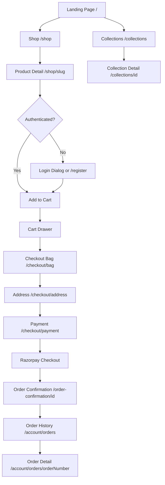
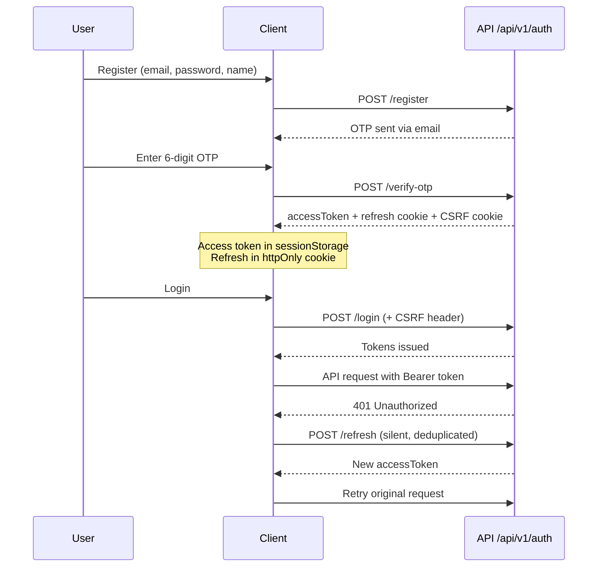
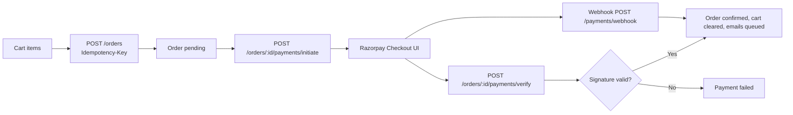
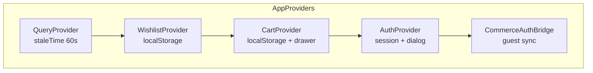
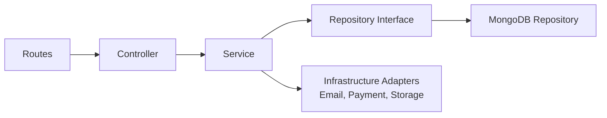
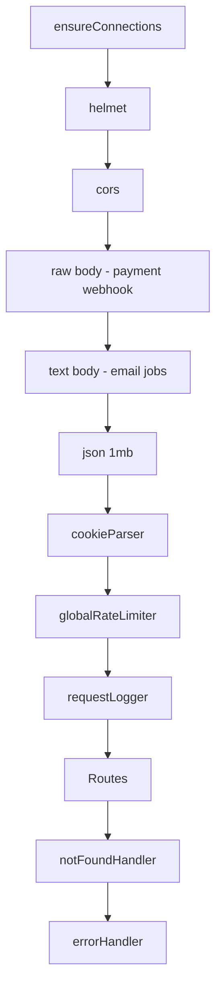
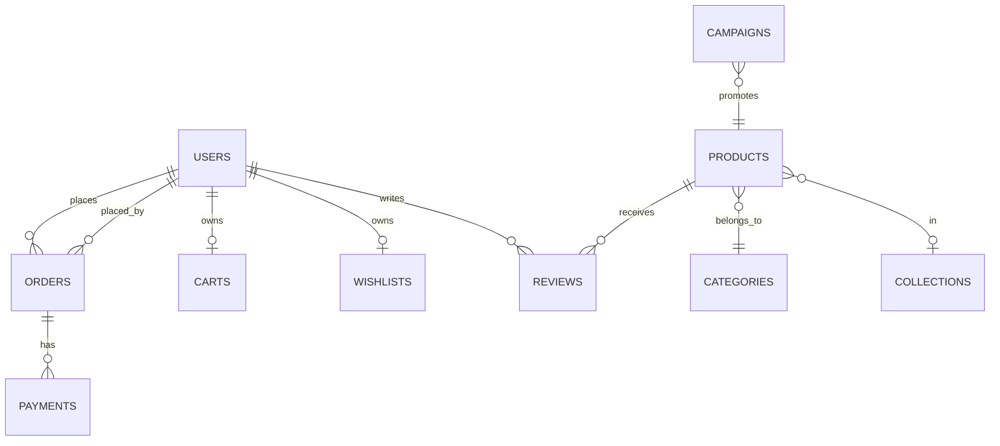
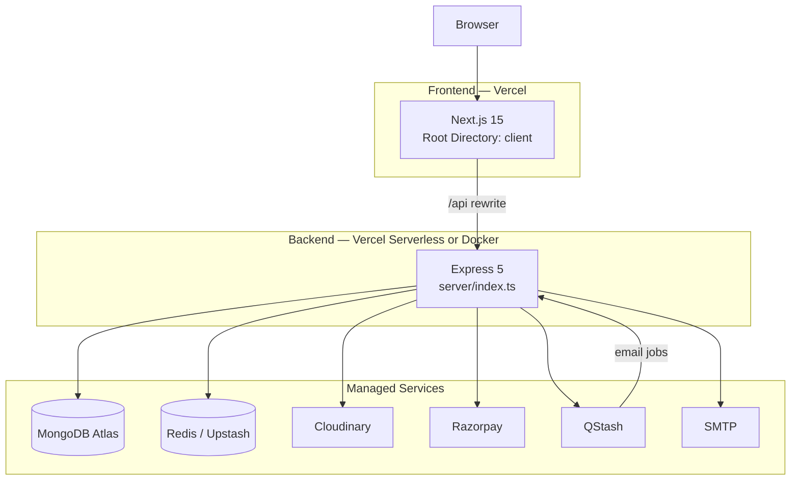

# SAAN

**Atmospheric Couture** — a production-grade luxury e-commerce platform for SAAN, a slow-fashion clothing brand. The monorepo ships an editorial storefront, authenticated checkout, and a full admin operations suite, backed by a feature-first Express API and MongoDB.


| | |
|---|---|
| **Version** | `0.1.0` (client & server) |
| **License** | Not implemented yet — no `LICENSE` file in the repository |
| **Frontend** | Next.js 15 · React 19 · Tailwind CSS v4 |
| **Backend** | Node.js · Express 5 · TypeScript |
| **Database** | MongoDB (Mongoose) |
| **Cache** | Redis (ioredis) |

---

# Table of Contents

- [Project Overview](#project-overview)
- [Features](#features)
- [User Journey](#user-journey)
- [Design Language](#design-language)
- [Design System](#design-system)
  - [Colors](#colors)
  - [Typography](#typography)
  - [Spacing System](#spacing-system)
  - [Border Radius](#border-radius)
  - [Shadows](#shadows)
  - [Motion](#motion)
  - [Responsive Strategy](#responsive-strategy)
- [Frontend Architecture](#frontend-architecture)
- [Backend Architecture](#backend-architecture)
- [Database](#database)
- [Authentication](#authentication)
- [Authorization](#authorization)
- [API Documentation](#api-documentation)
- [Third Party Services](#third-party-services)
- [Environment Variables](#environment-variables)
- [Security](#security)
- [Performance](#performance)
- [Accessibility](#accessibility)
- [SEO](#seo)
- [Deployment](#deployment)
- [Local Development](#local-development)
- [Available Scripts](#available-scripts)
- [Folder Structure](#folder-structure)
- [Coding Standards](#coding-standards)
- [Error Handling](#error-handling)
- [Logging](#logging)
- [Monitoring](#monitoring)
- [Testing](#testing)
- [Roadmap](#roadmap)
- [Contributing](#contributing)
- [License](#license)
- [Acknowledgements](#acknowledgements)

---

# Project Overview

## What it is

SAAN is a full-stack e-commerce platform for a luxury Indian couture brand. It combines an editorial, magazine-like storefront with catalog browsing, cart and wishlist, OTP-based registration, Razorpay checkout, order tracking, and a comprehensive admin dashboard for products, collections, campaigns, customers, analytics, and newsletter operations.

## Why it exists

The platform is built to sell high-consideration fashion online without resorting to generic e-commerce patterns. Product storytelling, craftsmanship, and brand restraint are first-class concerns — the codebase reflects a **quiet luxury** positioning (slow fashion, editorial layouts, intentional motion) rather than discount-driven retail.

## Who it is for

| Audience | Purpose |
|---|---|
| **Customers** | Discover collections, shop by occasion, purchase couture, manage addresses and orders |
| **Admins** | Manage catalog, inventory, campaigns, orders, payments, contacts, and newsletter campaigns |
| **Developers** | Maintain a swappable, testable backend and a typed frontend integrated via a versioned API contract |

## Core objectives

- Deliver a premium, editorial shopping experience on the web
- Provide end-to-end commerce: catalog → cart → address → payment → confirmation → order history
- Operate a secure, role-based admin back office with analytics
- Maintain clean architecture: repository interfaces, Zod validation, consistent API envelopes, and separated client/server type ownership

## Business value

- **Revenue**: Razorpay-integrated checkout with idempotent order placement and webhook reconciliation
- **Operations**: Admin tooling for products, stock, orders, payments, and customer support (contacts)
- **Marketing**: Homepage campaigns, newsletter subscription and broadcast, editorial journal content
- **Trust**: OTP email verification, JWT session management, structured logging, and rate limiting

---

# Features

## Customer Features

| Feature | Status |
|---|---|
| Editorial homepage with hero, collections, trending, testimonials, journal teaser | Implemented |
| Shop catalog with filters (category, occasion, price, size) | Implemented |
| Product detail pages with gallery, size selection, reviews | Implemented |
| Collections browsing | Implemented |
| Guest cart (localStorage) + authenticated server cart sync | Implemented |
| Guest wishlist + server wishlist sync | Implemented |
| Slide-out cart drawer (no page redirect) | Implemented |
| Checkout flow: bag → address → payment | Implemented |
| Razorpay payment initiation and verification | Implemented |
| Order confirmation and order history | Implemented |
| Account profile and address book | Implemented |
| OTP registration and email verification | Implemented |
| Login, forgot password, reset password | Implemented |
| Contact form | Implemented |
| Newsletter subscription | Implemented |
| Journal (static editorial articles) | Implemented |
| Atelier brand story page | Implemented |
| Product reviews (authenticated) | Implemented |

## Admin Features

| Feature | Status |
|---|---|
| Dashboard with summary stats, monthly sales, targets, top products, recent orders | Implemented |
| Product CRUD, stock adjustment, image upload (Cloudinary) | Implemented |
| Category and size management | Implemented |
| Collection CRUD | Implemented |
| Campaign CRUD with storefront preview | Implemented |
| Order list and detail, status updates, cancellation | Implemented |
| Payment list | Implemented |
| Customer list and detail | Implemented |
| Contact inbox with status management | Implemented |
| Newsletter subscriber management and campaign send | Implemented |
| Admin profile | Implemented |
| Light/dark theme toggle (admin shell only) | Implemented |

## Developer Features

| Feature | Status |
|---|---|
| Typed API client with envelope unwrapping and 401 refresh interceptor | Implemented |
| Zod DTOs on server; aligned types in `client/lib/types/` | Implemented |
| Repository pattern with swappable MongoDB implementations | Implemented |
| Jest unit and integration tests (server) | Implemented |
| Docker Compose for local MongoDB + Redis + server | Implemented |
| Zod-validated environment configuration | Implemented |
| Cursor rules for architecture and integration contracts | Implemented |

## Infrastructure Features

| Feature | Status |
|---|---|
| MongoDB persistence | Implemented |
| Redis rate limiting, login lockout, idempotency, analytics cache | Implemented |
| Cloudinary image storage | Implemented |
| Nodemailer transactional email | Implemented |
| Upstash QStash email queue (production) | Implemented |
| Razorpay payment gateway + webhooks | Implemented |
| Health (`/health`) and readiness (`/ready`) endpoints | Implemented |
| Graceful shutdown (SIGTERM/SIGINT) | Implemented |

## Future Features

| Feature | Evidence |
|---|---|
| Supabase-backed promo banners | SQL migration exists at `client/supabase/migrations/001_promo_banners.sql` but no Supabase client in codebase |
| Sanity CMS content | Studio route exists; schema registry is empty (`sanity/schemaTypes/index.ts`) — campaigns moved to Express |
| Redis cart cache | Mentioned in `server/.env.example` comment; cart persists in MongoDB only |
| `docker/client.Dockerfile` | Referenced in workspace rules; file not present |
| Frontend test suite | No test scripts in `client/package.json` |
| CI/CD pipeline | No `.github/` workflows |
| Application monitoring / APM | Not implemented yet |
| Sitemap, robots.txt, Open Graph, structured data | Not implemented yet |

---

# User Journey

## Customer Journey



| Step | Route | Description |
|---|---|---|
| Landing | `/` | Editorial homepage: hero, campaigns, collections, trending, journal teaser |
| Shop | `/shop` | Filterable product catalog |
| Collection | `/collections`, `/collections/[id]` | Curated collection pages |
| Product | `/shop/[slug]` | PDP with gallery, size, quantity, reviews |
| Wishlist | `/wishlist` | Saved products (guest localStorage or server) |
| Bag | `/checkout/bag` | Review cart before checkout |
| Address | `/checkout/address` | Select or enter shipping address |
| Payment | `/checkout/payment` | Place order + Razorpay |
| Confirmation | `/order-confirmation/[id]` | Post-purchase summary |
| Tracking | `/account/orders/[orderNumber]` | Order status and line items |

## Authentication Journey



| Step | Route / UI | Backend |
|---|---|---|
| Register | `/register` or `LoginDialog` | `POST /api/v1/auth/register` |
| Verify OTP | OTP step UI | `POST /api/v1/auth/verify-otp` |
| Resend OTP | Resend control | `POST /api/v1/auth/resend-otp` |
| Login | `/register?mode=login` or dialog | `POST /api/v1/auth/login` |
| Forgot password | `/register?mode=forgot-password` | `POST /api/v1/auth/forgot-password` |
| Reset password | `/reset-password` | `POST /api/v1/auth/reset-password` |
| Profile update | `/account` | `PATCH /api/v1/auth/me` |
| Logout | Account menu | `POST /api/v1/auth/logout` |

Post-authentication, `CommerceAuthBridge` merges guest cart and wishlist into server-side records.

## Checkout Journey



Currency: **INR**. Shipping: complimentary across India (`ORDER_CONSTANTS.STANDARD_SHIPPING_CHARGE = 0`).

## Admin Journey

```mermaid
flowchart TD
    A[/admin] --> B[Redirect /admin/dashboard]
    B --> C{Refresh cookie present?}
    C -->|No| D[404 notFound]
    C -->|Yes| E{role === admin?}
    E -->|No| F[Redirect home]
    E -->|Yes| G[Admin Dashboard]
    G --> H[Products / Orders / Customers / Analytics / ...]
```

Admin routes are blocked from search indexing (`robots: { index: false, follow: false }`).

---

# Design Language

Design philosophy is codified in `.cursor/rules/01-brand-philosophy.mdc` and implemented across `client/app/globals.css` and component patterns.

## Brand personality

- **Quiet luxury** — restrained, sophisticated, calm, confident
- **Slow fashion** — craftsmanship and storytelling over urgency
- **Editorial** — magazine-like layouts, generous whitespace, typographic hierarchy
- **Signature dot** — a single maroon/ink dot used sparingly (logo, section markers, loading cues)

Reference aesthetic: brands such as The Row, Loewe, Aesop, Toteme — explicitly **not** SaaS, startup, or discount-retail patterns.

## Visual principles

- Neutral palette with signature maroon accent (`#5c1a24`)
- Minimal chrome; no flash banners, countdown pressure, or aggressive CTAs on storefront
- Premium product presentation: crossfade hover images, editorial photography
- Admin shell uses a separate, functional UI with optional dark mode

## Layout philosophy

- Full-width editorial sections with `.section-py` vertical rhythm
- Container-less (`--container-max: 100%`) editorial layouts
- Header offset: `pt-16 md:pt-[72px]` under fixed navigation
- Checkout and admin omit global header/footer (`AppChrome`)

## Spacing philosophy

- Section spacing token: `--spacing-section: 7.5rem`
- Utility: `.section-py` → `py-16 md:py-24`
- Surface variants for tonal section breaks (champagne, warm, maroon tint, charcoal, newsletter)

## Motion philosophy

- Luxury easing: `cubic-bezier(0.25, 1, 0.5, 1)` — deliberate, not bouncy
- Fade easing: `cubic-bezier(0.16, 1, 0.3, 1)` for reveals and crossfades
- Lenis smooth scroll on storefront; disabled when `prefers-reduced-motion`
- Primary buttons use horizontal fill-draw on hover (desktop); filled by default on mobile

## Photography direction

- Hero video preload: `/videos/hero-desert-fort.mp4`
- Product and collection imagery from Cloudinary, local `public/images/`, and legacy Shopify CDN patterns (`next.config.ts` remote patterns)
- Editorial, full-bleed compositions on homepage and collection heroes

## Iconography

- **Lucide React** (`lucide-react`) for UI icons in admin and functional components
- Text-based logo with signature dot (`SaanLogo`) rather than heavy iconography on storefront

## Component philosophy

- Feature-first folders under `components/`
- Shared primitives in `components/ui/` (`CtaButton`, `ProductCard`, `ModalShell`, `Container`)
- Composition over monoliths; motion isolated in `components/motion/`

## Micro interactions

- Link underline draw (`.link-underline`)
- Button fill draw (`.btn-primary-fill`, `.btn-primary-fill-light`)
- Product image crossfade on hover/focus-within
- Cart badge pop animation (`animate-cart-pop`)
- Marquee announcements in header bar

## Accessibility philosophy

- WCAG AA minimum (workspace rule `09-accessibility-standards.mdc`)
- Keyboard navigation, focus-visible rings, semantic HTML, alt text
- `prefers-reduced-motion` respected globally in CSS and via `useReducedMotion` hook
- Dialogs use `role="dialog"`, `aria-modal`, labelled titles

---

# Design System

Tokens are defined in `client/app/globals.css` via Tailwind CSS v4 `@theme`. There is no separate `tailwind.config.*` file.

## Colors

| Color | Hex | Usage |
|---|---|---|
| **Primary (Ink)** | `#0b0a09` | Body text, borders, primary button fill |
| **Secondary (Signature)** | `#5c1a24` | Brand accent, maroon surfaces (`--color-saan-maroon`) |
| **Background (Paper)** | `#ffffff` | Page background (`--color-paper`) |
| **Surface** | `#ffffff` | Cards, elevated panels (`--color-surface`) |
| **Midnight** | `#12100e` | Dark sections (`--color-midnight`, `--color-saan-charcoal`) |
| **Border (Neutral 300)** | `#e8e4de` | Dividers, skeleton (`--color-neutral-300`, `--color-saan-champagne`) |
| **Text (Ink)** | `#0b0a09` | Primary copy |
| **Muted (Neutral 500)** | `#a79e90` | Secondary copy, placeholders |
| **Neutral 700** | `#3a362f` | Tertiary emphasis |
| **Success** | `#3f6b4a` | Success states |
| **Warning** | — | **Not implemented yet** — no warning token in `@theme` |
| **Danger (Error)** | `#b3261e` | Errors, destructive emphasis (`--color-error`, `--color-accent-crimson`) |
| **Surface Maroon Tint** | `rgb(92 26 36 / 0.04)` | Subtle brand-tinted sections (`--color-saan-surface-maroon`) |

## Typography

### Fonts

| Role | Family | Source |
|---|---|---|
| **Display** | Fraunces | Google Font (`next/font/google`), variable `--font-fraunces`, opsz axis |
| **Body** | General Sans | Local woff2 in `public/fonts/` (400, 500, 600, 700) |

### Weights

| Token / usage | Weight |
|---|---|
| Display headings | 400 |
| Body | 400 |
| Body medium / UI labels | 500 |
| General Sans Bold (available) | 700 |

### Type scale

| Class | Mobile size | Desktop (≥768px) | Line height | Letter spacing |
|---|---|---|---|---|
| `.text-display-xl` | 2.75rem | 4.5rem | 1.05 | -0.02em |
| `.text-display-l` | 2.25rem | 3.25rem | 1.08 | -0.02em |
| `.text-h1` | 1.875rem | 2.5rem | 1.15 | -0.015em |
| `.text-h2` | 1.5rem | 1.875rem | 1.2 | -0.01em |
| `.text-h3` | 1.25rem | 1.375rem | 1.25 | — |
| `.text-body-l` | 1.125rem | — | 1.6 | — |
| `.text-body` | 1rem | — | 1.6 | — |
| `.text-body-medium` | 1rem | — | 1.5 | — |
| `.text-ui` / `.text-label-caps` | 0.8125rem | — | 1.4 | 0.12em, uppercase |
| `.text-caption` | 0.75rem | — | 1.5 | — |

### Button typography

Uses `.text-ui` / label caps pattern on primary CTAs; display font on hero headlines.

### Navigation typography

Logo: `.text-h3` with `tracking-[0.06em]` (`SaanLogo`). Nav links use body/UI scale.

---

## Spacing System

| Token / utility | Value |
|---|---|
| `--spacing-section` | `7.5rem` |
| `.section-py` | `4rem` (mobile) / `6rem` (md+) — `py-16 md:py-24` |
| Marquee gap | `3rem` |
| Trending card gap | `1rem` |
| Journal card width | `350px` |

Tailwind default spacing scale (`p-4`, `gap-6`, etc.) is used throughout components.

---

## Border Radius

> **Not implemented yet** as formal design tokens.

Ad-hoc Tailwind utilities are used per component:

| Usage | Classes observed |
|---|---|
| Modals / drawers | `rounded-t-2xl` |
| Admin cards | `rounded-2xl`, `rounded-3xl` |
| Filter chips | `rounded-none` (sharp editorial chips) |
| Signature dot | `rounded-full` |
| Admin controls | `rounded-lg`, `rounded-full` |

---

## Shadows

> **Not implemented yet** as `@theme` elevation tokens.

Ad-hoc shadows in components:

| Shadow | Usage |
|---|---|
| `shadow-sm`, `shadow-lg`, `shadow-xl`, `shadow-2xl` | Tailwind defaults (admin, modals) |
| `shadow-[0_10px_24px_rgba(11,10,9,0.14)]` | Custom elevation |
| `shadow-[0_1px_0_rgba(11,10,9,0.03)]` | Hairline separation |
| `shadow-[0_8px_24px_rgba(255,255,255,0.08)]` | Light-on-dark elevation |

---

## Motion

### CSS transitions

| Pattern | Duration | Easing |
|---|---|---|
| Link underline draw | 0.45s | `--ease-luxury` |
| Button fill draw | 0.5s | `--ease-luxury` |
| Product image crossfade | 0.6s | `--ease-fade` |

### Durations (Framer Motion — `lib/motion.ts`)

| Constant | Duration |
|---|---|
| `luxuryTransition` | 0.6s |
| `fadeTransition` | 0.8s |

### Easing

| Token | Value |
|---|---|
| `--ease-luxury` / `LUXURY_EASE` | `cubic-bezier(0.25, 1, 0.5, 1)` |
| `--ease-fade` / `FADE_EASE` | `cubic-bezier(0.16, 1, 0.3, 1)` |

### Animations

| Name | Duration | Usage |
|---|---|---|
| `marquee` | 40s / 30s / 20s | Announcement bar |
| `cart-pop` | 0.5s | Cart badge |
| `skeleton-pulse` | 1.8s | Loading skeletons |

### Hover animations

- Button fill draw (desktop)
- Product image crossfade
- Link underline scaleX

### Scroll animations

- `ScrollReveal` component (Framer Motion + Intersection Observer)
- Lenis smooth scroll (`LenisProvider`)
- Hero scroll container (`HeroScrollContainer`)

### Reveal animations

- `fadeUpVariants`, `imageRevealVariants`, `collectionSlideLeft/Right`, `statSlideUp` in `lib/motion.ts`

### Page transitions

> **Not implemented yet** — no Next.js page transition wrapper.

---

## Responsive Strategy

### Breakpoints

Custom typography breakpoints in `globals.css`:

| Breakpoint | Usage |
|---|---|
| `768px` | Display/heading scale bump, trending card width, mobile button fill behavior |
| `1024px` | Trending card max width |

Tailwind default breakpoints (`sm`, `md`, `lg`, `xl`) are used across components.

### Mobile-first approach

- Base styles target mobile; `@media (min-width: 768px)` enhances typography and layout
- Primary buttons render filled on viewports `<768px` (touch-friendly)
- Filter drawer uses bottom sheet pattern on small screens
- Sticky shop filters on desktop; drawer on mobile

---

# Frontend Architecture

## Stack

| Layer | Technology |
|---|---|
| Framework | Next.js 15.5 (App Router) |
| Language | TypeScript 5.9 (strict) |
| Styling | Tailwind CSS v4 (`@tailwindcss/postcss`) |
| Routing | File-based App Router (`app/`) |
| State | TanStack React Query 5 + React Context |
| Animation | Framer Motion 12, Lenis 1.3 |
| Validation | Zod 3.25 |
| Charts (admin) | Recharts 3.9 |
| CMS tooling | Sanity 3.99 (Studio only; empty schema) |

## Routing

- **Storefront**: `app/page.tsx`, `app/shop/`, `app/collections/`, etc.
- **Account**: `app/account/` with shared `AccountShell` layout
- **Admin**: `app/(admin)/admin/` route group → `/admin/*`
- **Auth hub**: `/register` with query modes (`login`, `forgot-password`) — no dedicated `/login` route
- **API proxy**: `next.config.ts` rewrites `/api/:path*` → `${BACKEND_ORIGIN}/api/:path*`

## State management



| Store | Mechanism | Key |
|---|---|---|
| Server data | TanStack Query | Query keys per module |
| Auth session | Context + sessionStorage | `saan_access_token`, `saan_user` |
| Guest cart | Context + localStorage | `saan-cart` |
| Guest wishlist | Context + localStorage | `saan-wishlist` |
| Admin theme | Context + localStorage | `saan-admin-theme` |

## Component architecture

Feature-first directories under `components/` with shared UI primitives in `components/ui/`.

## Hooks (`hooks/`)

| Hook | Purpose |
|---|---|
| `useStorefrontProducts` | Cached catalog fetching |
| `useRequireAuth` | Gate actions behind authentication |
| `useGuestOnly` | Redirect authenticated users |
| `useCurrentUser` | Access auth context user |
| `useReducedMotion` | Respect OS motion preference |

## API communication

- **Single client**: `lib/api/client.ts` — envelope unwrap, CSRF, Bearer token, 401 refresh
- **Server components**: `lib/auth/server-fetch.ts` — cookie-forwarding, `cache: 'no-store'`
- **Error mapping**: `lib/api/errors.ts` — centralized user-facing messages

## Forms & validation

- Zod schemas in `client/lib/types/*.schemas.ts` and module types
- Auth forms in `components/auth/`
- Admin forms use `AdminFormField` and module-specific pages

## Loading strategy

- `Suspense` boundaries on shop catalog, product recommendations, auth pages
- Skeleton utilities (`.skeleton`, `animate-skeleton`)
- React Query loading states in admin tables

## Code splitting & lazy loading

- Next.js automatic route-based splitting
- Campaign slide images: `loading="lazy"` when not prioritized
- `next/image` with `priority` on above-fold content

## Error boundaries

> **Not implemented yet** — no dedicated React error boundary components found.

## Frontend folder tree

```
client/
├── app/                          # Next.js App Router pages & layouts
│   ├── (admin)/admin/            # Admin dashboard (/admin/*)
│   ├── account/                  # Customer account area
│   ├── checkout/                 # bag → address → payment
│   ├── collections/              # Collection listing & detail
│   ├── shop/                     # Catalog & PDP
│   ├── journal/                  # Editorial articles (static)
│   ├── studio/                   # Sanity Studio (/studio)
│   ├── globals.css               # Design tokens & utilities
│   └── layout.tsx                # Root layout, fonts, providers
├── components/
│   ├── account/                  # Account shell, orders, addresses
│   ├── admin/                    # Admin feature pages & ui/
│   ├── auth/                     # Login dialog, register/OTP flows
│   ├── checkout/                 # Checkout & confirmation
│   ├── home/                     # Homepage sections (~25)
│   ├── layout/                   # Header, Footer, CartDrawer, AppChrome
│   ├── motion/                   # ScrollReveal, CountUp, Typewriter
│   ├── product/                  # PDP components
│   ├── providers/                # Query, Auth, Cart, Wishlist providers
│   ├── shop/                     # Filters, hero
│   └── ui/                       # Shared primitives
├── hooks/                        # Custom React hooks
├── lib/
│   ├── api/                      # Typed API modules (20 files)
│   ├── auth/                     # Token store, CSRF, server guards
│   ├── types/                    # API shapes & Zod schemas
│   ├── commerce/                 # Guest cart/wishlist sync
│   ├── motion.ts                 # Framer Motion constants
│   ├── site-content.ts           # Static nav, journal, marketing copy
│   └── sanity/                   # Sanity client (configured, unused for content)
├── public/                       # Fonts, images, videos
├── sanity/                       # Sanity schema (empty registry)
├── reference/                    # Design prototypes (non-runtime)
├── next.config.ts                # API rewrite, image remote patterns
└── vercel.json                   # Vercel deployment config
```

### Important folders

| Folder | Role |
|---|---|
| `app/` | Routes, metadata, layouts |
| `components/` | All UI, feature-first |
| `lib/api/` | **Only** place for HTTP calls to backend |
| `lib/types/` | Client-side API contract types |
| `lib/auth/` | Session, CSRF, admin server guard |
| `public/` | Static assets served as-is |

---

# Backend Architecture

## Stack

| Layer | Technology |
|---|---|
| Runtime | Node.js 22 |
| Framework | Express 5 |
| Language | TypeScript 5.9 (strict) |
| ODM | Mongoose 8 (MongoDB only in infrastructure layer) |
| Validation | Zod 3.25 |
| Logging | Pino + pino-http |
| Testing | Jest 30 + Supertest + mongodb-memory-server |

## Architecture pattern

Strict one-directional flow:



## Entry points

| File | Purpose |
|---|---|
| `dev-server.ts` | Local development — listens on `PORT`, graceful shutdown |
| `index.ts` | Vercel serverless export (`export default app`) |
| `http/express-app.ts` | Express app assembly |

## Middleware pipeline



## Backend folder tree

```
server/
├── config/
│   └── env.ts                    # Zod-validated environment
├── http/
│   └── express-app.ts            # Express assembly
├── middlewares/
│   ├── auth.middleware.ts        # JWT verify, requireRole
│   ├── csrf.middleware.ts        # Double-submit CSRF
│   ├── error-handler.ts          # AppError → envelope
│   ├── rate-limit.middleware.ts  # Redis-backed limiters
│   ├── validate.middleware.ts    # Zod DTO validation
│   ├── idempotency-key.middleware.ts
│   ├── request-logger.ts         # Pino HTTP + 404
│   └── ensure-connections.middleware.ts
├── modules/                      # Feature-first vertical slices
│   ├── auth/
│   ├── product/
│   ├── order/
│   ├── payment/
│   ├── cart/
│   ├── wishlist/
│   ├── category/
│   ├── collection/
│   ├── campaign/
│   ├── review/
│   ├── size/
│   ├── user/
│   ├── contact/
│   ├── newsletter/
│   ├── analytics/
│   └── upload/
├── infrastructure/
│   ├── database/
│   │   ├── mongodb/
│   │   │   ├── models/           # Mongoose schemas ONLY here
│   │   │   └── repositories/     # Interface implementations
│   │   └── redis/                # Rate limit, lockout, idempotency, cache
│   ├── email/                    # Nodemailer + QStash queue
│   ├── payment-gateway/          # Razorpay adapter
│   └── storage/                  # Cloudinary adapter
├── shared/
│   ├── errors/                   # AppError hierarchy
│   ├── utils/                    # Response envelope, auth cookies, slugs
│   ├── constants/
│   └── validation/
├── tests/
│   ├── integration/              # Supertest flow tests
│   └── setup.ts
├── dev-server.ts
└── index.ts
```

### Module anatomy (each feature)

```
modules/<feature>/
├── <feature>.routes.ts
├── <feature>.controller.ts
├── <feature>.service.ts
├── <feature>.repository.interface.ts
├── <feature>.dto.ts
├── <feature>.types.ts
├── <feature>.module.ts          # Composition root / DI wiring
└── <feature>.test.ts
```

---

# Database

## Technology

- **MongoDB 7** via **Mongoose 8**
- Repository interfaces in `server/modules/*/` decouple business logic from persistence
- Only `infrastructure/database/mongodb/` may import Mongoose

## Collections

| Collection | Purpose | Relationships | Indexes |
|---|---|---|---|
| **users** | Customer and admin accounts, embedded addresses | Referenced by orders, carts, wishlists, reviews | `email` (unique), `{ role, createdAt }` |
| **products** | Catalog items with sizes, images, pricing | → categories, collections; ← order items, cart, wishlist, reviews, campaigns | `slug` (unique), `categoryId`, `collectionId`, `occasion`, `status`, text index on name+description, compound price indexes |
| **orders** | Purchase records with address snapshot | → user, products (items) | `userId`, `status`, `paymentStatus`, `createdAt`, `orderNumber` (unique sparse) |
| **payments** | Razorpay payment records | → order | `orderId`, `gatewayOrderId`, `status`, `gatewayPaymentId` (partial unique) |
| **carts** | Authenticated shopping carts | → user, products | `userId` (unique) |
| **wishlists** | Saved products | → user, products | `userId` (unique) |
| **categories** | Product taxonomy | ← products | `slug` (unique) |
| **collections** | Curated product groupings | ← products | `slug` (unique), `status`, `sortOrder`, `featured`, compound listing index |
| **reviews** | Product ratings and text | → product, user | `productId`, `{ productId, userId }` (unique) |
| **sizes** | Garment size registry | Referenced in product.sizeId | `sizeId` (unique), `label` (unique) |
| **campaigns** | Homepage promotional campaigns | → product | `productId`, date range, `priority`, `active`, compound active index |
| **contacts** | Contact form submissions | — | `email`, `status`, `createdAt` |
| **newsletters** | Email subscribers | — | `email` (unique), `status`, `subscribedAt` |
| **newslettercampaigns** | Admin broadcast campaigns | → user (admin) | `status`, `createdAt` |
| **monthlytargets** | Admin sales targets | — | `{ month, year }` (unique) |
| **counters** | Atomic sequences (order numbers) | — | `_id` key |

## Relationships diagram



## Validation

- Mongoose schema validators at persistence layer
- Zod DTOs at API boundary (`*.dto.ts`)
- Business rules in services (stock checks, pricing, idempotency)

## Naming conventions

- MongoDB collections: lowercase plural (Mongoose default)
- Domain IDs: string `id` in API responses (mapped from `_id`)
- Order numbers: Amazon-style `###-#######-#######`

---

# Authentication

## Registration

1. `POST /api/v1/auth/register` — creates unverified user, hashes password (bcrypt), sends 6-digit OTP email
2. `POST /api/v1/auth/verify-otp` — validates OTP, marks verified, issues tokens

## Login

- `POST /api/v1/auth/login` — email/password; requires CSRF header
- Failed attempts tracked in Redis (`login:attempts:{email}`); **5 failures → 15-minute lockout**

## JWT

| Token | Storage | TTL | Secret |
|---|---|---|---|
| Access | Response body → client sessionStorage | Default `15m` | `JWT_ACCESS_SECRET` |
| Refresh | httpOnly cookie (`saan_refresh_token`) | Default `7d` | `JWT_REFRESH_SECRET` |

Refresh token hash (SHA-256) stored in MongoDB; rotated on login, verify-otp, and refresh.

## Password hashing

- **bcrypt** with cost factor from `BCRYPT_ROUNDS` (minimum **12**)

## OTP

- 6-digit numeric OTP on registration and resend
- Expiry: `OTP_EXPIRY_MINUTES` (default 10)
- Hashed at rest (`otpHash`); attempt counter on user document

## Forgot / reset password

1. `POST /api/v1/auth/forgot-password` — sends reset link to `APP_URL/reset-password`
2. `POST /api/v1/auth/reset-password` — validates token, updates password, increments `refreshTokenVersion`

## CSRF

Double-submit cookie pattern: readable `saan_csrf_token` cookie + `X-CSRF-Token` header on mutating auth routes.

## Session management

- Access token sent as `Authorization: Bearer <token>`
- Client silent refresh on 401 (deduplicated in `lib/api/client.ts`)
- Logout clears refresh hash in DB and cookies

## Protected routes

- **API**: `authMiddleware` attaches `req.user`; `requireRole('admin')` for admin routes
- **Frontend account**: client-side auth checks + API 401 handling
- **Frontend admin**: server cookie gate + `AdminAccessGate` role check

---

# Authorization

Role-based access with two roles defined on the user model:

| Role | Permissions |
|---|---|
| **customer** | Own cart, wishlist, orders, addresses, reviews; profile update |
| **admin** | All admin routes under `/api/v1/admin/*`; product/category/collection/campaign CRUD; order status updates; analytics; newsletter send; contact management; uploads |

Non-admin users receive `403 Forbidden` on admin endpoints. Non-authenticated users receive `401 Unauthorized`.

---

# API Documentation

All routes are prefixed **`/api/v1`**. Responses use the standard envelope:

```json
{ "success": true, "data": {}, "meta": {} }
{ "success": false, "error": { "code": "...", "message": "...", "details": [] } }
```

## Health

| Method | Endpoint | Description | Auth | Request | Response |
|---|---|---|---|---|---|
| GET | `/health` | Liveness probe | No | — | `{ status: "ok" }` |
| GET | `/ready` | Readiness (Mongo + Redis) | No | — | `{ status, mongo, redis }` |

## Auth — `/auth`

| Method | Endpoint | Description | Auth | Request body | Response |
|---|---|---|---|---|---|
| GET | `/auth/csrf` | Issue CSRF cookie | No | — | CSRF token |
| POST | `/auth/register` | Register + send OTP | No | `{ email, password, firstName, lastName }` | Success message |
| POST | `/auth/verify-otp` | Verify email OTP | No | `{ email, otp }` | `{ accessToken, user }` + cookies |
| POST | `/auth/resend-otp` | Resend OTP | No | `{ email }` | Success message |
| POST | `/auth/login` | Login | No + CSRF | `{ email, password }` | `{ accessToken, user }` + cookies |
| POST | `/auth/refresh` | Rotate tokens | No + CSRF | — (refresh cookie) | `{ accessToken, user }` |
| PATCH | `/auth/me` | Update profile | Bearer + CSRF | `{ firstName, lastName, mobileNumber?, dateOfBirth? }` | Updated user |
| POST | `/auth/logout` | Logout | Bearer + CSRF | — | Success |
| POST | `/auth/forgot-password` | Request reset email | No | `{ email }` | Success message |
| POST | `/auth/reset-password` | Reset password | No + CSRF | `{ email, token, newPassword }` | Success message |

## Products — `/products`

| Method | Endpoint | Description | Auth | Request | Response |
|---|---|---|---|---|---|
| GET | `/products` | List products (paginated, filterable) | Optional Bearer | Query: `page`, `limit`, filters | Product list + meta |
| GET | `/products/:slug` | Product by slug | No | — | Product |
| POST | `/products` | Create product | Admin | Product DTO | Product |
| PATCH | `/products/:id` | Update product | Admin | Partial product DTO | Product |
| PATCH | `/products/:id/sizes/:sizeId/stock` | Adjust stock | Admin | `{ quantity }` | Updated stock |
| DELETE | `/products/:id` | Archive product | Admin | — | Success |

## Products (admin read) — `/admin/products`

| Method | Endpoint | Description | Auth | Response |
|---|---|---|---|---|
| GET | `/admin/products/:id` | Product by ID | Admin | Product |

## Reviews

| Method | Endpoint | Description | Auth | Request | Response |
|---|---|---|---|---|---|
| GET | `/products/:productId/reviews` | List reviews | No | — | Reviews |
| POST | `/products/:productId/reviews` | Create review | Bearer | `{ rating, review }` | Review |
| PATCH | `/reviews/:id` | Update review | Bearer | Partial review | Review |
| DELETE | `/reviews/:id` | Delete review | Bearer | — | Success |

## Categories — `/categories`

| Method | Endpoint | Description | Auth | Request | Response |
|---|---|---|---|---|---|
| GET | `/categories` | List categories | No | — | Categories |
| POST | `/categories` | Create | Admin | `{ name, slug }` | Category |
| PATCH | `/categories/:id` | Update | Admin | Partial | Category |

## Sizes — `/sizes`

| Method | Endpoint | Description | Auth | Request | Response |
|---|---|---|---|---|---|
| GET | `/sizes` | List sizes | No | — | Sizes |
| POST | `/sizes` | Create | Admin | Size DTO | Size |
| PATCH | `/sizes/:id` | Update | Admin | Partial | Size |
| DELETE | `/sizes/:id` | Delete | Admin | — | Success |

## Collections — `/collections`

| Method | Endpoint | Description | Auth | Response |
|---|---|---|---|---|
| GET | `/collections` | Public list | No | Collections |
| GET | `/collections/:slug` | By slug | No | Collection + products |

## Collections (admin) — `/admin/collections`

| Method | Endpoint | Description | Auth | Request | Response |
|---|---|---|---|---|---|
| GET | `/admin/collections` | List all | Admin | — | Collections |
| GET | `/admin/collections/:id` | By ID | Admin | — | Collection |
| POST | `/admin/collections` | Create | Admin | Collection DTO | Collection |
| PATCH | `/admin/collections/:id` | Update | Admin | Partial | Collection |
| DELETE | `/admin/collections/:id` | Delete | Admin | — | Success |

## Cart — `/cart`

| Method | Endpoint | Description | Auth | Request | Response |
|---|---|---|---|---|---|
| GET | `/cart` | Get cart | Bearer | — | Cart |
| POST | `/cart/items` | Add item | Bearer | `{ productId, sizeId, quantity }` | Cart |
| PATCH | `/cart/items/:cartItemId` | Update quantity | Bearer | `{ quantity }` | Cart |
| DELETE | `/cart/items/:cartItemId` | Remove item | Bearer | — | Cart |
| DELETE | `/cart` | Clear cart | Bearer | — | Success |

## Wishlist — `/wishlist`

| Method | Endpoint | Description | Auth | Request | Response |
|---|---|---|---|---|---|
| GET | `/wishlist` | Get wishlist | Bearer | — | Wishlist |
| POST | `/wishlist/items` | Add item | Bearer | `{ productId }` | Wishlist |
| DELETE | `/wishlist/items/:wishlistItemId` | Remove | Bearer | — | Wishlist |
| POST | `/wishlist/items/:wishlistItemId/move-to-cart` | Move to cart | Bearer | — | Cart |

## Orders — `/orders`

| Method | Endpoint | Description | Auth | Request | Response |
|---|---|---|---|---|---|
| GET | `/orders` | Customer orders | Bearer | Query: pagination | Orders + meta |
| GET | `/orders/:id` | Order detail | Bearer | — | Order |
| POST | `/orders` | Place order | Bearer | `{ addressId \| address, items }` + **`Idempotency-Key`** header | Order |
| PATCH | `/orders/:id/status` | Update status | Admin | `{ status }` | Order |
| POST | `/orders/:id/cancel` | Cancel order | Bearer | — | Order |

## Orders (admin) — `/admin/orders`

| Method | Endpoint | Description | Auth | Response |
|---|---|---|---|---|
| GET | `/admin/orders` | List with filters | Admin | Orders + meta |
| GET | `/admin/orders/:id` | Detail with customer | Admin | AdminOrderDetail |

## Payments

| Method | Endpoint | Description | Auth | Request | Response |
|---|---|---|---|---|---|
| POST | `/orders/:orderId/payments/initiate` | Create Razorpay order | Bearer | — | `{ keyId, gatewayOrderId, amount, ... }` |
| POST | `/orders/:orderId/payments/verify` | Verify payment signature | Bearer | Razorpay callback payload | Payment + order |
| GET | `/orders/:orderId/payments` | Payment history | Bearer | — | Payments |
| POST | `/payments/webhook` | Razorpay webhook | Signature | Raw JSON body | Ack |

## Payments (admin) — `/admin/payments`

| Method | Endpoint | Description | Auth | Response |
|---|---|---|---|---|
| GET | `/admin/payments` | List payments | Admin | Payments + meta |

## Users / Addresses — `/users`

| Method | Endpoint | Description | Auth | Request | Response |
|---|---|---|---|---|---|
| GET | `/users/me/addresses` | List addresses | Bearer | — | Addresses |
| POST | `/users/me/addresses` | Create address | Bearer | Address DTO | Address |
| PATCH | `/users/me/addresses/:addressId` | Update | Bearer | Partial | Address |
| DELETE | `/users/me/addresses/:addressId` | Delete | Bearer | — | Success |
| PATCH | `/users/me/addresses/:addressId/default` | Set default | Bearer | — | Address |

## Customers (admin) — `/admin/customers`

| Method | Endpoint | Description | Auth | Response |
|---|---|---|---|---|
| GET | `/admin/customers` | List customers | Admin | Customers + meta |
| GET | `/admin/customers/:id` | Customer detail | Admin | Customer |

## Campaigns — `/campaigns`

| Method | Endpoint | Description | Auth | Request | Response |
|---|---|---|---|---|---|
| GET | `/campaigns/active` | Active storefront campaigns | No | — | Campaigns |
| GET | `/campaigns` | All campaigns | Admin | — | Campaigns |
| GET | `/campaigns/:id` | By ID | Admin | — | Campaign |
| POST | `/campaigns` | Create | Admin | Campaign DTO | Campaign |
| PATCH | `/campaigns/:id` | Update | Admin | Partial | Campaign |
| DELETE | `/campaigns/:id` | Delete | Admin | — | Success |

## Uploads — `/uploads`

| Method | Endpoint | Description | Auth | Request | Response |
|---|---|---|---|---|---|
| POST | `/uploads` | Upload images | Admin | `multipart/form-data` | `{ url, publicId, ... }` |

## Contact

| Method | Endpoint | Description | Auth | Request | Response |
|---|---|---|---|---|---|
| POST | `/contact` | Submit form | No | Contact DTO | Success |
| GET | `/admin/contacts` | List (admin) | Admin | — | Contacts |
| GET | `/admin/contacts/:id` | Detail | Admin | — | Contact |
| PATCH | `/admin/contacts/:id/status` | Update status | Admin | `{ status }` | Contact |
| DELETE | `/admin/contacts/:id` | Delete | Admin | — | Success |

## Newsletter

| Method | Endpoint | Description | Auth | Request | Response |
|---|---|---|---|---|---|
| POST | `/newsletter` | Subscribe | No | `{ email }` | Success |
| GET | `/admin/newsletter` | List subscribers | Admin | — | Subscribers |
| PATCH | `/admin/newsletter/:id/status` | Update status | Admin | `{ status }` | Subscriber |
| DELETE | `/admin/newsletter/:id` | Delete | Admin | — | Success |
| GET | `/admin/newsletter/campaigns` | Campaign history | Admin | — | Campaigns |
| POST | `/admin/newsletter/campaigns/send` | Send broadcast | Admin | Campaign DTO | Result |

## Analytics — `/admin/analytics`

| Method | Endpoint | Description | Auth | Response |
|---|---|---|---|---|
| GET | `/admin/analytics/summary` | Dashboard summary | Admin | Stats |
| GET | `/admin/analytics/monthly-sales` | Monthly sales chart | Admin | Sales data |
| GET | `/admin/analytics/target` | Current target | Admin | Target |
| GET | `/admin/analytics/statistics` | Statistics | Admin | Stats |
| GET | `/admin/analytics/top-products` | Top sellers | Admin | Products |
| GET | `/admin/analytics/recent-orders` | Recent orders | Admin | Orders |
| GET | `/admin/analytics/targets` | All targets | Admin | Targets |
| POST | `/admin/analytics/targets` | Set target | Admin | Target |

## Internal — `/internal/email-jobs`

| Method | Endpoint | Description | Auth | Request | Response |
|---|---|---|---|---|---|
| POST | `/internal/email-jobs` | Process queued email | QStash signature | Email job payload | Ack |

---

# Third Party Services

| Service | Purpose | Where Used | Configuration |
|---|---|---|---|
| **MongoDB** | Primary database | All persistence via Mongoose repositories | `MONGO_URI` |
| **Redis** | Rate limiting, login lockout, order idempotency, analytics cache | `middlewares/rate-limit.middleware.ts`, `login-lockout.store.ts`, `idempotency.store.ts`, `analytics-cache.ts` | `REDIS_URL` (use `rediss://` for Upstash TLS) |
| **Cloudinary** | Product/campaign image uploads | `infrastructure/storage/cloudinary-storage.service.ts`, admin upload route | `CLOUDINARY_CLOUD_NAME`, `CLOUDINARY_API_KEY`, `CLOUDINARY_API_SECRET`, `CLOUDINARY_FOLDER` |
| **Razorpay** | Payment gateway | `infrastructure/payment-gateway/razorpay-gateway.service.ts` | `RAZORPAY_KEY_ID`, `RAZORPAY_KEY_SECRET`, `RAZORPAY_WEBHOOK_SECRET`, `RAZORPAY_TEST_MODE` |
| **Nodemailer (SMTP)** | Transactional email delivery | `infrastructure/email/nodemailer-email.service.ts` | `SMTP_HOST`, `SMTP_PORT`, `SMTP_USER`, `SMTP_PASSWORD`, `EMAIL_FROM_*` |
| **Upstash QStash** | Durable email job queue (production) | `infrastructure/email/qstash-email.queue.ts` | `EMAIL_QUEUE_DRIVER=qstash`, `QSTASH_*`, `SERVER_PUBLIC_URL` |
| **Sanity** | CMS Studio shell (no active schemas) | `app/studio/`, `sanity.config.ts` | `NEXT_PUBLIC_SANITY_PROJECT_ID`, `NEXT_PUBLIC_SANITY_DATASET` |
| **Vercel** | Frontend and serverless API hosting | `client/vercel.json`, `server/vercel.json`, `server/index.ts` | Platform env vars |
| **Google Fonts** | Fraunces display typeface | `app/layout.tsx` | CDN (Next.js font optimization) |
| **Analytics (third-party)** | — | **Not implemented yet** | — |
| **Maps** | — | **Not implemented yet** | — |
| **CDN** | Image delivery | Cloudinary (`res.cloudinary.com`), Next.js Image Optimization | Remote patterns in `next.config.ts` |
| **Supabase** | — | Migration file only; **not integrated** | — |

---

# Environment Variables

## Server (`server/.env`)

Copy from `server/.env.example`:

```env
# Runtime
NODE_ENV=development
PORT=4000

# Database & cache
MONGO_URI=mongodb://localhost:27017/saan
REDIS_URL=redis://localhost:6379

# JWT
JWT_ACCESS_SECRET=change-me-to-a-secure-access-secret-min-32-chars
JWT_REFRESH_SECRET=change-me-to-a-secure-refresh-secret-min-32-chars
JWT_ACCESS_EXPIRES_IN=15m
JWT_REFRESH_EXPIRES_IN=7d

# CORS & URLs
CORS_ORIGINS=http://localhost:3000
APP_URL=http://localhost:3000

# Security
BCRYPT_ROUNDS=12
COOKIE_SECURE=false
COOKIE_SAME_SITE=lax
REFRESH_TOKEN_COOKIE_NAME=saan_refresh_token
CSRF_TOKEN_COOKIE_NAME=saan_csrf_token

# Auth timing
OTP_EXPIRY_MINUTES=10
PASSWORD_RESET_EXPIRY_MINUTES=30

# Email
SMTP_HOST=smtp.example.com
SMTP_PORT=587
SMTP_USER=your-smtp-user
SMTP_PASSWORD=your-smtp-password
EMAIL_FROM_NAME=SAAN
EMAIL_FROM_ADDRESS=noreply@saan.example
ADMIN_EMAIL=admin@saan.example

# Email queue (use qstash in production)
EMAIL_QUEUE_DRIVER=in-process
SERVER_PUBLIC_URL=http://localhost:4000
QSTASH_TOKEN=
QSTASH_CURRENT_SIGNING_KEY=
QSTASH_NEXT_SIGNING_KEY=

# Logging
LOG_LEVEL=info

# Razorpay
RAZORPAY_TEST_MODE=true
RAZORPAY_KEY_ID=rzp_test_your_key_id
RAZORPAY_KEY_SECRET=your_razorpay_key_secret
RAZORPAY_WEBHOOK_SECRET=your_razorpay_webhook_secret

# Cloudinary
CLOUDINARY_CLOUD_NAME=your_cloud_name
CLOUDINARY_API_KEY=your_api_key
CLOUDINARY_API_SECRET=your_api_secret
CLOUDINARY_FOLDER=saan/products
```

## Client (`client/.env.local`)

Copy from `client/.env.example`:

```env
# Backend API origin (must match server PORT / deployed API URL)
BACKEND_ORIGIN=http://localhost:4000

# Sanity (optional — Studio only; schema is empty)
NEXT_PUBLIC_SANITY_PROJECT_ID=your_project_id
NEXT_PUBLIC_SANITY_DATASET=production
SANITY_API_READ_TOKEN=
```

> **Note:** `client/.env.example` defaults `BACKEND_ORIGIN` to `http://localhost:8000`, while the server defaults to `PORT=4000`. Align these values in local development.

### Production requirements (enforced by `server/config/env.ts`)

- `ADMIN_EMAIL` required
- `EMAIL_QUEUE_DRIVER` must be `qstash`
- Razorpay keys required (webhook secret required for live keys)
- Cloudinary credentials required

---

# Security

| Measure | Implementation |
|---|---|
| **Password hashing** | bcrypt, cost ≥ 12 (`BCRYPT_ROUNDS`) |
| **JWT** | Separate access/refresh secrets (≥ 32 chars); short access TTL |
| **Refresh tokens** | httpOnly secure cookie; SHA-256 hash in DB; rotation on use |
| **CSRF** | Double-submit cookie on auth mutations |
| **Rate limiting** | Redis-backed (in-memory in dev): global 200/15min, auth 20/15min, public forms 10/15min, sensitive 3/15min |
| **Login lockout** | 5 failed attempts → 15 min Redis lockout per email |
| **Helmet** | Secure HTTP headers |
| **CORS** | Explicit origin allow-list (`CORS_ORIGINS`); credentials enabled |
| **Validation** | Zod DTOs on every mutating route |
| **Body size limits** | JSON 1 MB; webhook/raw bodies capped |
| **Idempotency** | `Idempotency-Key` header on order placement (Redis, 24h TTL) |
| **Payment verification** | HMAC signature validation (Razorpay) |
| **Webhook verification** | Razorpay signature on raw body |
| **QStash jobs** | Signature verification on internal email endpoint |
| **Secrets** | `.env` gitignored; Zod validation at boot; never logged |
| **File upload** | Admin-only; multer memory storage; Cloudinary upload |
| **Trust proxy** | `app.set('trust proxy', 1)` for correct IP behind reverse proxy |

---

# Performance

| Optimization | Location |
|---|---|
| **Image optimization** | `next/image` with remote patterns; `priority` on LCP images |
| **Lazy loading** | Campaign slides, below-fold images |
| **Code splitting** | Next.js App Router automatic per-route splitting |
| **React Query cache** | 60s staleTime (storefront), 5min categories |
| **ISR / revalidation** | Campaign data: `revalidate: 60` |
| **Static generation** | `generateStaticParams` for journal articles |
| **Redis caching** | Analytics summary/monthly sales (60s TTL) |
| **Pagination** | `page`/`limit` on list endpoints (default 20, max 100) |
| **Compression** | Handled by hosting platform (Vercel) |
| **Bundle** | Next.js production build tree-shaking |
| **Memoization** | Component-level patterns; React Query deduplication |
| **Database indexes** | Compound and text indexes on products, orders, payments (see Database) |
| **GPU layer utility** | `.gpu-layer` for transform-heavy animations |
| **Font loading** | `display: swap` on all fonts |
| **Smooth scroll** | Lenis (disabled for reduced motion) |

---

# Accessibility

| Practice | Implementation |
|---|---|
| **Semantic HTML** | `<main>`, `<nav aria-label>`, heading hierarchy |
| **ARIA** | Dialogs (`role="dialog"`, `aria-modal`), live regions (`aria-live`), toggle buttons (`aria-pressed`) |
| **Keyboard navigation** | Focusable controls, modal close, filter drawer |
| **Focus management** | `focus-visible:outline-*`, `focus-visible:ring-*` across interactive elements |
| **Contrast** | Ink on paper (#0b0a09 on #ffffff); error/success tokens defined |
| **Alt text** | `next/image` alt props on product/gallery components |
| **Reduced motion** | Global CSS override + `useReducedMotion` hook disables Lenis and shortens animations |
| **Screen readers** | `sr-only` labels on form inputs; status/alert roles on errors |
| **Target** | WCAG AA (workspace standard) |

---

# SEO

| Feature | Status |
|---|---|
| Root metadata (title, description) | Implemented — `app/layout.tsx` |
| Per-page `metadata` exports | Implemented — shop, collections, journal, atelier, contact, checkout, account |
| Dynamic `generateMetadata` | Implemented — product, collection, journal detail |
| Admin `robots: noindex` | Implemented — admin layout |
| `lang="en"` on `<html>` | Implemented |
| **Open Graph tags** | **Not implemented yet** |
| **Twitter cards** | **Not implemented yet** |
| **JSON-LD structured data** | **Not implemented yet** |
| **Canonical URLs** | **Not implemented yet** |
| **sitemap.ts / sitemap.xml** | **Not implemented yet** |
| **robots.ts / robots.txt** | **Not implemented yet** |

---

# Deployment

## Architecture



## Frontend hosting

- **Vercel** with `client/vercel.json`
- Set project **Root Directory** to `client`
- Configure `BACKEND_ORIGIN` to production API URL

## Backend hosting

- **Vercel serverless**: `server/index.ts` exports Express app; `server/vercel.json` for build
- **Docker Compose** (local/staging): `docker-compose.yml` — MongoDB, Redis, server on port 4000
- **Docker image**: `docker/server.Dockerfile` (multi-stage Node 22 Alpine)

> **Note:** `docker/server.Dockerfile` CMD references `dist/server.js`, but the compiled entry from `dev-server.ts` is excluded from the production TypeScript build. Verify the production start command matches your deployment target.

## Production checklist

- [ ] Set all server env vars in hosting platform (Vercel env injection)
- [ ] `REDIS_URL` with `rediss://` for Upstash TLS
- [ ] `CORS_ORIGINS` includes frontend URL
- [ ] `APP_URL` set to frontend URL (password reset emails)
- [ ] `COOKIE_SECURE=true` in production
- [ ] `EMAIL_QUEUE_DRIVER=qstash` with all QStash keys
- [ ] `ADMIN_EMAIL` configured
- [ ] MongoDB Atlas network access configured
- [ ] Razorpay live keys + webhook secret (production)
- [ ] Cloudinary credentials configured
- [ ] `BACKEND_ORIGIN` on frontend points to deployed API

---

# Local Development

## Prerequisites

- **Node.js** 22+ (Dockerfile uses Node 22)
- **npm**
- **MongoDB** 7 (local or Docker)
- **Redis** 7 (local or Docker)

## Clone

```bash
git clone <repository-url>
cd SAAN
```

## Install

```bash
# Backend
cd server && npm install

# Frontend
cd ../client && npm install
```

## Environment

```bash
cp server/.env.example server/.env
cp client/.env.example client/.env.local
# Edit both files — ensure BACKEND_ORIGIN matches server PORT
```

## Run with Docker (MongoDB + Redis + server)

```bash
# From repository root
docker compose up -d mongodb redis
# Or full stack including server:
docker compose up
```

## Run backend

```bash
cd server
npm run dev
# Listens on http://localhost:4000 (default)
```

## Run frontend

```bash
cd client
npm run dev
# Listens on http://localhost:3000 (Next.js default)
```

## Production build

```bash
# Backend
cd server && npm run build && npm start

# Frontend
cd client && npm run build && npm start
```

---

# Available Scripts

## Server (`server/package.json`)

| Script | Description |
|---|---|
| `dev` | Start development server with hot reload (`ts-node-dev`) |
| `build` | Compile TypeScript to `dist/` |
| `start` | Run compiled server (`node dist/dev-server.js`) |
| `test` | Run Jest test suite |
| `test:watch` | Jest in watch mode |
| `lint` | ESLint on `.ts` files |
| `format` | Prettier write |
| `typecheck` | TypeScript check (build config) |
| `typecheck:test` | TypeScript check (test config) |
| `seed:collections` | Seed collection data |

## Client (`client/package.json`)

| Script | Description |
|---|---|
| `dev` | Next.js development server |
| `build` | Production build |
| `start` | Production server |
| `lint` | Next.js ESLint |

---

# Folder Structure

```
SAAN/
├── client/                 # Next.js 15 frontend
├── server/                 # Express 5 backend (no src/ wrapper)
├── docker/
│   └── server.Dockerfile   # Multi-stage server image
├── docker-compose.yml      # MongoDB + Redis + server
├── .cursor/rules/          # Architecture & integration rules
├── vercel.json             # Root Vercel config (server build)
└── README.md
```

See [Frontend Architecture](#frontend-architecture) and [Backend Architecture](#backend-architecture) for detailed trees.

---

# Coding Standards

## Naming

| Context | Convention | Example |
|---|---|---|
| Server files | kebab-case | `product.service.ts` |
| Server classes | PascalCase | `ProductService` |
| Server interfaces | `I` prefix | `IProductRepository` |
| Constants | UPPER_SNAKE_CASE | `ORDER_CONSTANTS` |
| Booleans | Question form | `isVerified`, `hasStock` |
| Client components | PascalCase files | `ProductCard.tsx` |

## TypeScript

- `strict: true`, `noImplicitAny`, `noUncheckedIndexedAccess` (server)
- No `any` — use proper types or `unknown` with narrowing

## Import order (server)

External packages → `server/shared/` → relative imports

## Formatting

- **Prettier** (server): single quotes, semicolons, trailing commas, 100 print width
- **ESLint**: server (`@typescript-eslint`); client (`eslint-config-next`)

## API contract

- Client types in `client/lib/types/`; server DTOs in `server/modules/*/*.dto.ts`
- All HTTP via `client/lib/api/client.ts`
- Response envelope unwrapped consistently
- See `.cursor/rules/17-frontend-integration.mdc`

## Git

- Conventional commits: `feat:`, `fix:`, `refactor:`, `test:`, `chore:`, `docs:`, `perf:`
- Branch naming: `feature/<desc>`, `fix/<desc>`, `chore/<desc>`

## Pre-commit hooks

> **Not implemented yet** — no Husky/lint-staged configuration found.

---

# Error Handling

## Backend

- Domain errors extend `AppError` with `statusCode`, `code`, `details`
- Subclasses: `NotFoundError`, `ValidationError`, `UnauthorizedError`, `ForbiddenError`, `ConflictError`
- Controllers throw errors; `error-handler.ts` middleware maps to envelope
- Unknown errors → generic 500 (no stack traces in production responses)
- Infrastructure errors (Mongo/Redis) → 503 where appropriate

## Frontend

- `ApiError` class with `code`, `message`, `details`
- Centralized message map in `lib/api/errors.ts`
- 401 triggers silent refresh before surfacing error
- Form field errors extracted via `getFieldErrors()` for validation responses

---

# Logging

## Backend

- **Pino** structured JSON logging via `pino-http`
- Request ID per request; method, path, status, duration logged
- User ID included when authenticated
- Log level configurable via `LOG_LEVEL`
- Secrets, passwords, and payment card data are never logged

## Frontend

> **Not implemented yet** — no client-side logging service (e.g. Sentry) integrated.

---

# Monitoring

> **Not implemented yet.**

No APM, error tracking, or metrics dashboard integration found in the codebase. Health endpoints (`/health`, `/ready`) are available for load balancer probes.

---

# Testing

## Server

| Aspect | Detail |
|---|---|
| Framework | Jest 30 + ts-jest |
| Integration | Supertest against Express app |
| Database | mongodb-memory-server |
| Redis | ioredis-mock (integration tests) |
| Unit tests | 28 colocated `*.test.ts` files in modules |
| Integration tests | 9 flow tests in `server/tests/integration/` |
| Coverage | Configured for `modules/**` and `shared/**` |
| Run | `cd server && npm test` |

### Integration test flows

- `auth.flow.test.ts`
- `product.flow.test.ts`
- `order.flow.test.ts`
- `cart.flow.test.ts`
- `payment.flow.test.ts`
- `wishlist.flow.test.ts`
- `review.flow.test.ts`
- `analytics.flow.test.ts`
- `user.address.flow.test.ts`

## Client

> **Not implemented yet** — no test scripts or test files in `client/`.

## CI/CD

> **Not implemented yet** — no `.github/workflows/` directory.

---

# Roadmap

## Completed

- Full-stack luxury e-commerce (storefront + admin)
- OTP registration, JWT auth, CSRF protection
- Cart, wishlist, checkout, Razorpay payments
- Product catalog with filters, reviews, collections, campaigns
- Admin dashboard with analytics and monthly targets
- Newsletter subscription and admin broadcast
- Contact form with admin inbox
- Cloudinary image uploads
- QStash email queue for production
- Docker Compose local infrastructure
- Server test suite (unit + integration)

## In Progress

> **Not documented in repository** — no explicit in-progress tracking file.

## Planned

Based on codebase artifacts (not confirmed product roadmap):

| Item | Evidence |
|---|---|
| Supabase promo banner integration | `client/supabase/migrations/001_promo_banners.sql` |
| Sanity CMS content types | Empty schema; Studio scaffolded |
| Redis cart cache | Comment in `.env.example`; MongoDB-only today |
| Frontend test suite | No client tests |
| SEO (sitemap, OG, structured data) | Not present |
| CI/CD pipeline | No GitHub Actions |
| Application monitoring | Not present |
| Client Docker image | Referenced in rules, not in repo |

---

# Contributing

1. Fork the repository and create a branch: `feature/<short-description>` or `fix/<short-description>`
2. Follow the architecture rules in `.cursor/rules/` — especially repository pattern, API envelope, and frontend integration contract
3. Run server checks before submitting:
   ```bash
   cd server && npm run lint && npm run typecheck && npm test
   ```
4. Run client lint:
   ```bash
   cd client && npm run lint
   ```
5. Use conventional commit messages
6. Keep PRs scoped to one module or feature where possible
7. Open a pull request with a clear description and test plan

---

# License

> **Not implemented yet** — no `LICENSE` file exists in the repository. All packages are marked `"private": true` in their respective `package.json` files.

---

# Acknowledgements

### Core frameworks

- [Next.js](https://nextjs.org/) — React framework (App Router)
- [Express](https://expressjs.com/) — HTTP server
- [React](https://react.dev/) — UI library
- [TypeScript](https://www.typescriptlang.org/) — Type safety

### Data & cache

- [MongoDB](https://www.mongodb.com/) / [Mongoose](https://mongoosejs.com/)
- [Redis](https://redis.io/) / [ioredis](https://github.com/redis/ioredis)

### UI & motion

- [Tailwind CSS](https://tailwindcss.com/)
- [Framer Motion](https://www.framer.com/motion/)
- [Lenis](https://lenis.darkroom.engineering/) — smooth scroll
- [Lucide](https://lucide.dev/) — icons
- [Fraunces](https://fonts.google.com/specimen/Fraunces) — display typeface

### Commerce & infrastructure

- [Razorpay](https://razorpay.com/) — payments
- [Cloudinary](https://cloudinary.com/) — image CDN and uploads
- [Nodemailer](https://nodemailer.com/) — email delivery
- [Upstash QStash](https://upstash.com/qstash) — durable job queue

### Developer tooling

- [Zod](https://zod.dev/) — schema validation
- [TanStack Query](https://tanstack.com/query) — server state
- [Jest](https://jestjs.io/) / [Supertest](https://github.com/ladjs/supertest) — testing
- [Pino](https://getpino.io/) — structured logging
- [Recharts](https://recharts.org/) — admin analytics charts
